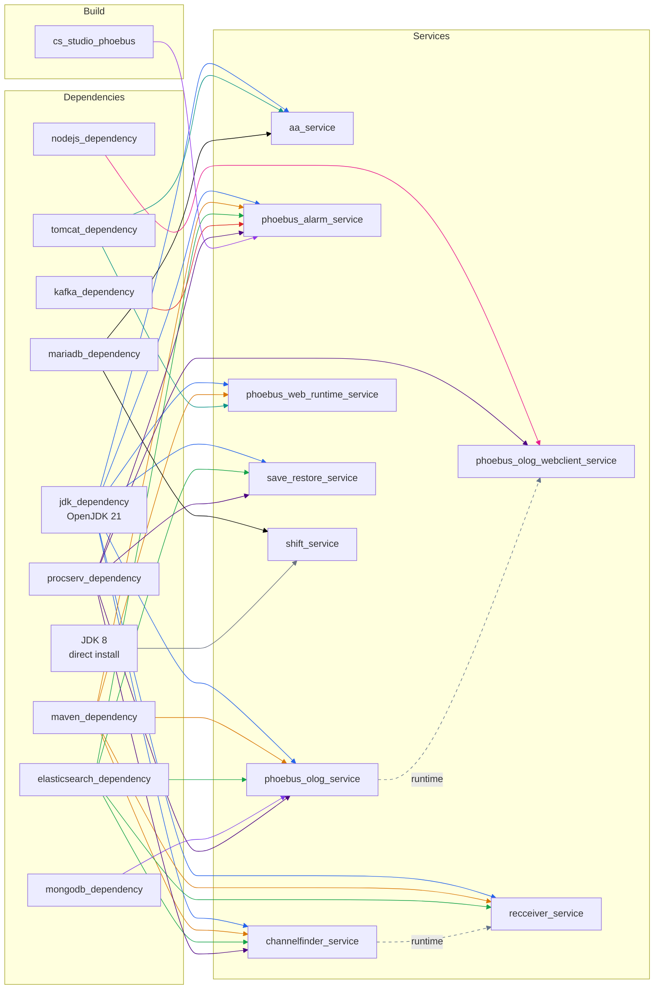

# nsls2.epics_services

Ansible collection for deploying EPICS middle-layer services.

Roles are designed to be generic — site-specific configuration (ports,
paths, authentication) is provided via an orchestration role or
`host_vars` in the consuming playbook.

## Requirements

- **RHEL 10** (or compatible) — baseline OS for all target hosts.
  Several services depend on system RPM packages that ship with
  RHEL 10, including Tomcat 10+ (required by Archiver Appliance 2.3.1
  for Jakarta EE) and OpenJDK 21.
- **Ansible** >= 2.15

## Installation

```bash
ansible-galaxy collection install nsls2.epics_services
```

Or from a local tarball:

```bash
ansible-galaxy collection build --force --output-path /tmp/
ansible-galaxy collection install /tmp/nsls2-epics_services-*.tar.gz
```

### Collection dependencies

This collection requires `community.general` and `community.mysql`.
Install them from `collections/requirements.yml`:

```bash
ansible-galaxy collection install -r collections/requirements.yml -p collections/
```

## Roles

### Service roles

These roles deploy EPICS services. Each service role is self-contained —
it includes its own dependencies (JDK, Maven, etc.) via `include_role`.
The consuming playbook just calls the service role; no dependency
orchestration is needed.

| Role | Description |
| --- | --- |
| `aa_service` | Archiver Appliance — single-node or clustered. Requires JDK, Tomcat, MariaDB JDBC connector. |
| `channelfinder_service` | ChannelFinder directory service. Requires JDK, Maven, Elasticsearch. |
| `phoebus_alarm_service` | Phoebus alarm server, logger, and config logger. Requires JDK, Maven, Elasticsearch, Kafka, CS-Studio Phoebus. |
| `phoebus_olog_service` | Phoebus Olog electronic logbook service. Requires JDK, Maven, Elasticsearch, MongoDB. |
| `phoebus_olog_webclient_service` | Phoebus Olog web client (React/Node.js). Includes `nodejs_dependency`. |
| `phoebus_web_runtime_service` | Phoebus web runtime (PVWS + DBWR WARs on Tomcat). Requires JDK, Maven, Tomcat. |
| `recceiver_service` | RecCeiver (RecSync) — IOC channel registration. Requires JDK, Maven, Elasticsearch, ChannelFinder. |
| `save_restore_service` | Save/restore service for machine snapshots. Requires procServ. |
| `shift_service` | Shift logbook service on GlassFish 5. Requires JDK 8, MariaDB JDBC connector. |

### Build / configuration roles

| Role | Description |
| --- | --- |
| `cs_studio_phoebus` | Clone and build the Phoebus product from source. |
| `cs_studio_preferences` | Deploy CS-Studio preference files. |
| `cs_studio_bobs` | Deploy CS-Studio BOB display files. |
| `cs_studio_bobs_web` | Build BOB web displays for the display builder web runtime. |
| `cs_studio_bobs_web_cache` | Flush the DBWR display cache. |

### Dependency roles

Shared infrastructure installed once and consumed by multiple services.
Centralizing these ensures consistent versions and single-point upgrades.

| Role | Installs | Key variables |
| --- | --- | --- |
| `jdk_dependency` | OpenJDK (default: 21) | `jdk_version`, `java_home` |
| `maven_dependency` | Apache Maven (default: 3.9.9) | `maven_version`, `mvn_home` |
| `elasticsearch_dependency` | Elasticsearch 8.x (default: 8.19.12) | `elastic_version`, `elastic_port` |
| `kafka_dependency` | Apache Kafka + Zookeeper (default: 3.9.2) | `kafka_version`, `kafka_port`, `zookeeper_port` |
| `mongodb_dependency` | MongoDB 8.0 | `mongodb_version`, `mongod_port` |
| `tomcat_dependency` | Apache Tomcat (RPM) | — |
| `mariadb_dependency` | MariaDB JDBC connector (RPM) | — |
| `nodejs_dependency` | Node.js via NodeSource | `nodejs_version` |
| `procserv_dependency` | procServ process manager | — |

## Service dependency graph



Solid arrows are build/install dependencies managed by the orchestration
layer. Dashed arrows are runtime dependencies — the target service must
be running before the dependent service can function.

## Dependency version control

RPM-based dependencies (Elasticsearch, MongoDB) are version-pinned in their
`defaults/main.yml` and locked on the target host using `dnf versionlock`.
This prevents `dnf-automatic` or manual `dnf update` from upgrading packages
between Ansible runs, which can cause service failures (e.g. keystore format
incompatibilities, data file version mismatches).

**How it works:**

1. The role installs the exact version specified in `elastic_version` /
   `mongodb_version`.
2. After install, `dnf versionlock add` locks the package so nothing else
   can change it.
3. When you update the version in `defaults/main.yml`, the role detects the
   mismatch, clears the old lock, installs the new version, and re-locks.

**To upgrade a dependency:** update the version variable in the role's
`defaults/main.yml`, commit, and run the playbook. The role handles the rest.

Source-installed dependencies (Kafka, Maven) are not affected — they are
downloaded as tarballs at a specific version and don't interact with the
system package manager.

## Architecture

See [docs/example-orchestration-role.md](docs/example-orchestration-role.md)
for a complete, ready-to-use example.

```
Orchestration role (site-specific)
├── defaults/main.yml        # Site defaults (ports, paths, auth)
├── tasks/main.yml           # Enable flags → include_role per service
└── tasks/cs_studio.yml      # Complex multi-step deploys stay in task files

nsls2.epics_services (this collection)
├── roles/*_service/         # Self-contained: includes own dependencies
└── roles/*_dependency/      # Shared infrastructure (JDK, Maven, ES, ...)
```

Each service role includes its own dependency roles via `include_role`.
Dependency roles are **idempotent** — they rely on Ansible's built-in
module idempotency to skip unchanged state and fix configuration drift.
Running the same dependency role from multiple service roles is safe and
fast (packages already installed, configs unchanged).

## Shared defaults (`vars/shared.yml`)

Variables used across multiple roles — service account, dependency versions,
derived paths, connection endpoints — are defined once in `vars/shared.yml`.
Every role loads this file as its first task:

```yaml
- name: Load collection-level shared defaults
  ansible.builtin.include_vars:
    file: "{{ role_path }}/../../vars/shared.yml"
```

Because `include_vars` sits at precedence 18, orchestration-level `set_fact`
(19) and playbook `extra_vars` (20) can still override any value.

## License

BSD-3-Clause
